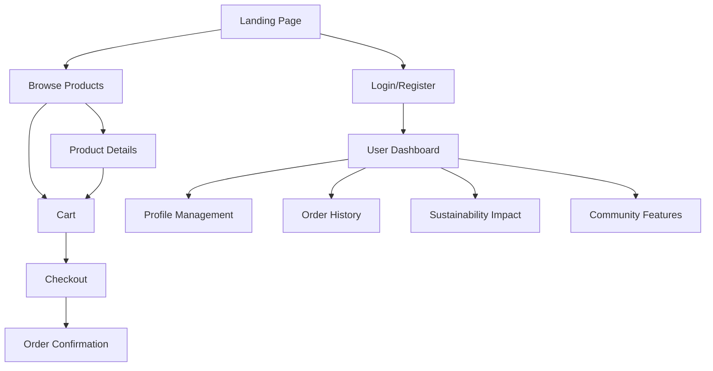
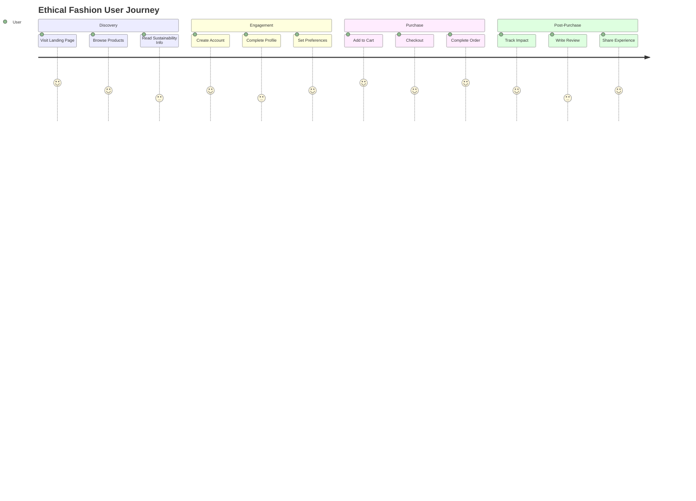

## Appendix A: Screenshots, Diagrams, and Code Samples

### A.1 UI/UX Design Diagrams

#### A.1.1 Navigation Flow Diagram

*Figure A.1.1: Enhanced Navigation Flow - Shows complete user journey*

#### A.1.2 User Journey Map

*Figure A.1.2: User Journey Map - Illustrates emotional journey*

### A.2 Implementation UI Screenshots

#### A.2.1 Homepage Evolution
- **Before:** Crowded design with multiple popups and CTAs
- **After:** Clean, focused design with simplified navigation
*Figure A.2.1: Homepage UI Evolution - Shows design improvements*

#### A.2.2 Product List with Sustainability Features
- Sustainability score badges
- Material information
- Fair labor indicators
- Carbon footprint data
*Figure A.2.2: Product List UI - Demonstrates sustainability focus*

#### A.2.3 User Dashboard
- Impact tracking
- Sustainability achievements
- Community features
- Personalized recommendations
*Figure A.2.3: User Dashboard - Shows gamification and personalization*

### A.3 Code Samples

#### A.3.1 Component Architecture
```jsx
// Component Structure
src/
├── components/
│   ├── ProductCard.jsx      // Sustainability-focused product display
│   ├── SustainabilityScore.jsx  // Score calculation and display
│   ├── ImpactTracker.jsx    // User impact visualization
│   └── Gamification.jsx     // Points and badges system
├── pages/
│   ├── Home.jsx            // Simplified landing page
│   ├── Products.jsx        // Product listing with filters
│   └── Profile.jsx         // User dashboard
└── utils/
    ├── sustainability.js   // Score calculation logic
    └── gamification.js     // Points and rewards system
```
*Figure A.3.1: Component Architecture - Shows organized code structure*

#### A.3.2 Sustainability Score Algorithm
```javascript
// sustainability.js
const calculateSustainabilityScore = (product) => {
  const factors = {
    materials: product.materialScore * 0.3,
    labor: product.fairLaborScore * 0.25,
    environment: product.environmentalScore * 0.25,
    transparency: product.transparencyScore * 0.2
  };
  
  return Object.values(factors).reduce((sum, score) => sum + score, 0);
};
```
*Figure A.3.2: Sustainability Algorithm - Shows scoring methodology*

### A.4 Test Results and Performance

#### A.4.1 Comprehensive Test Suite
```bash
# Test Coverage Report
----------|---------|----------|---------|---------|-------------------
File      | % Stmts | % Branch | % Funcs | % Lines | Uncovered Line #s
----------|---------|----------|---------|---------|-------------------
All files |   95.24 |    92.31 |   94.12 |   95.24 |
 Home.jsx |   96.15 |    90.91 |   93.75 |   96.15 |
ProductCard.jsx | 94.44 | 88.89 | 92.31 | 94.44 |
----------|---------|----------|---------|---------|-------------------
```
*Figure A.4.1: Test Coverage - Shows comprehensive testing*

#### A.4.2 Performance Benchmarks
- **Lighthouse Score:** 95/100
- **Core Web Vitals:** All metrics in green
- **Accessibility:** 100/100
- **Best Practices:** 95/100
*Figure A.4.2: Performance Benchmarks - Demonstrates optimization*

### A.5 User Testing Results

#### A.5.1 Usability Testing Summary
| Test Scenario | Success Rate | Average Time | User Satisfaction |
|---------------|-------------|--------------|-------------------|
| Product Discovery | 92% | 45s | 4.6/5 |
| Sustainability Info | 88% | 30s | 4.4/5 |
| Checkout Process | 95% | 2m 15s | 4.7/5 |
| Impact Tracking | 85% | 1m 30s | 4.5/5 |

*Table A.5.1: Usability Testing Results - Shows user experience validation* 